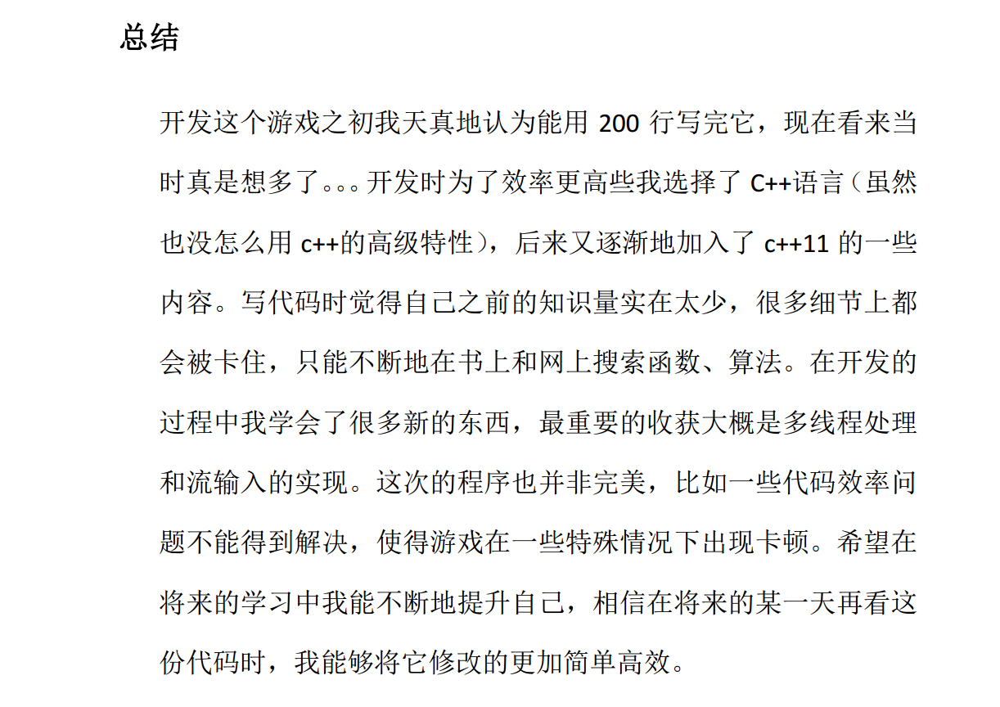

# Terminal Snake
Yet another terminal snake game
## Dependencies
You need to install these development libraries before compiling and running this game. 
* [tev-cpp](https://github.com/chemwolf6922/tiny-event-loop-cpp)
* [nlohmann-json](https://github.com/nlohmann/json)
## Why am I writing this
I accidentally found a piece of [junk](./originalCode/snake.cpp) I wrote around 10 years ago. Which is my course project of the C class for non-CS freshmen. And also a document with these words:

Yeah, what a stupid young man. Anyway, I though this is a good time to rewrite it. I mainly do it for fun. So don't judge me for building some unnecessary wheels.
## How do run the original game?
I don't know why I choose to develop the original game on Windows. (Maybe because I don't know what linux is at that time.). And I don't want to waste my time trying to compile source code from 10 years ago with cli tools on Windows. Luckily I still got a copy of the exe file. The text alignment does not work with modern monospace fonts. So the UI will look very off from what it used to be.
